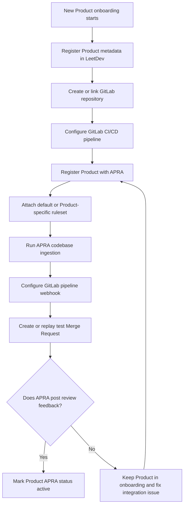
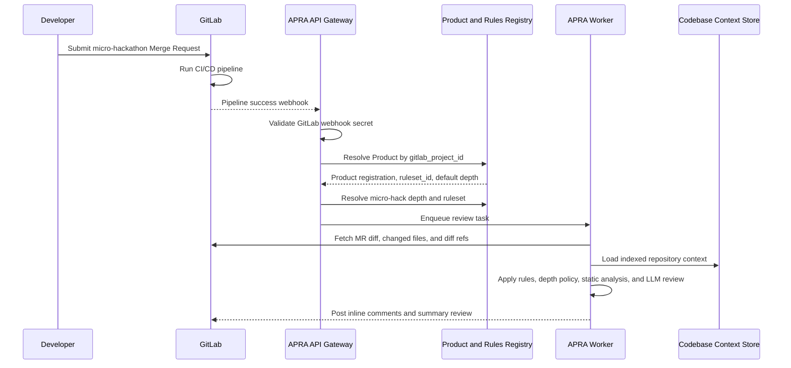
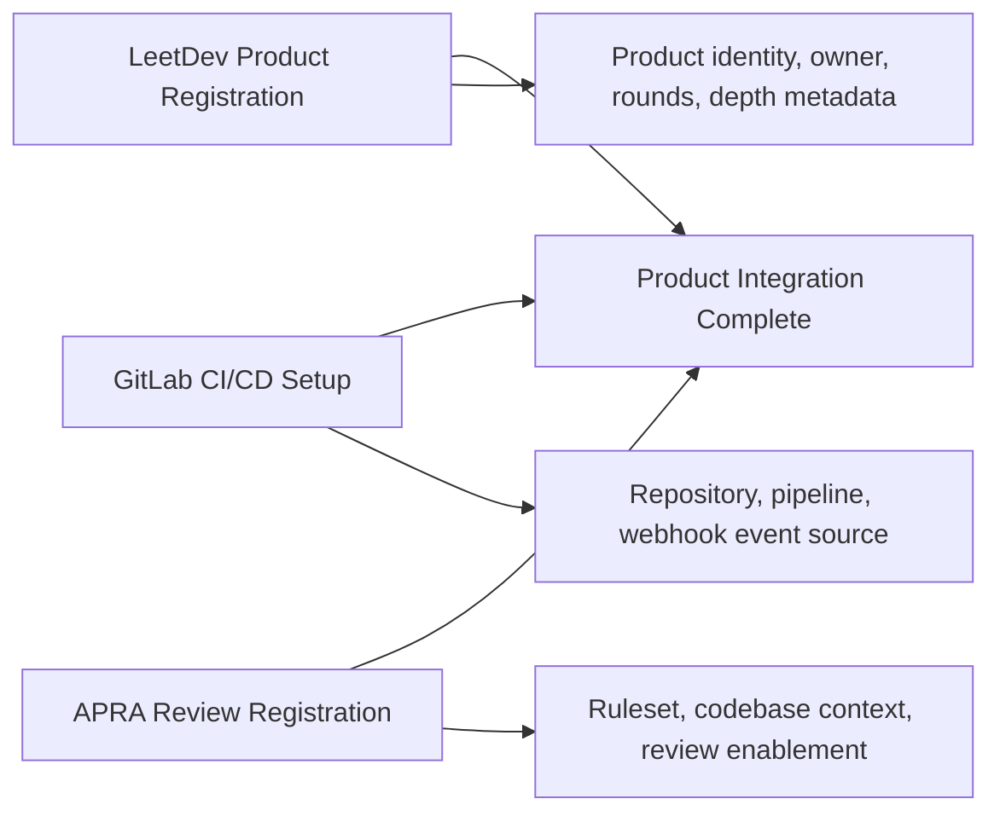
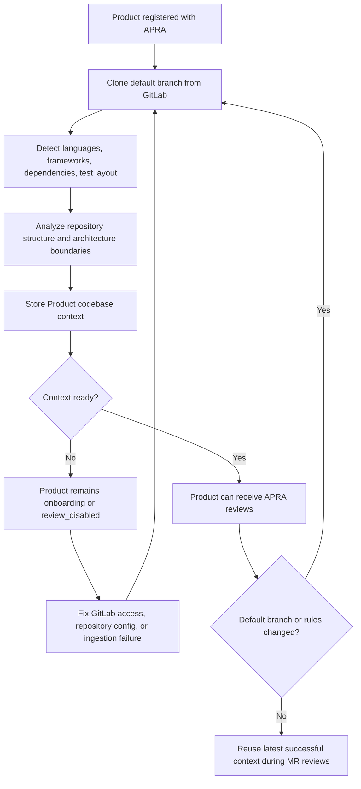
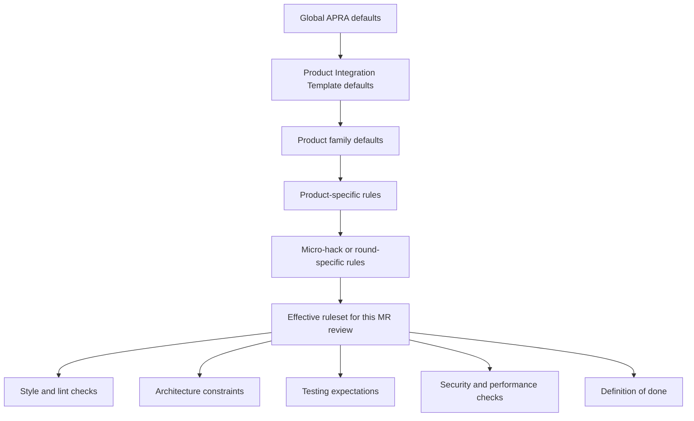
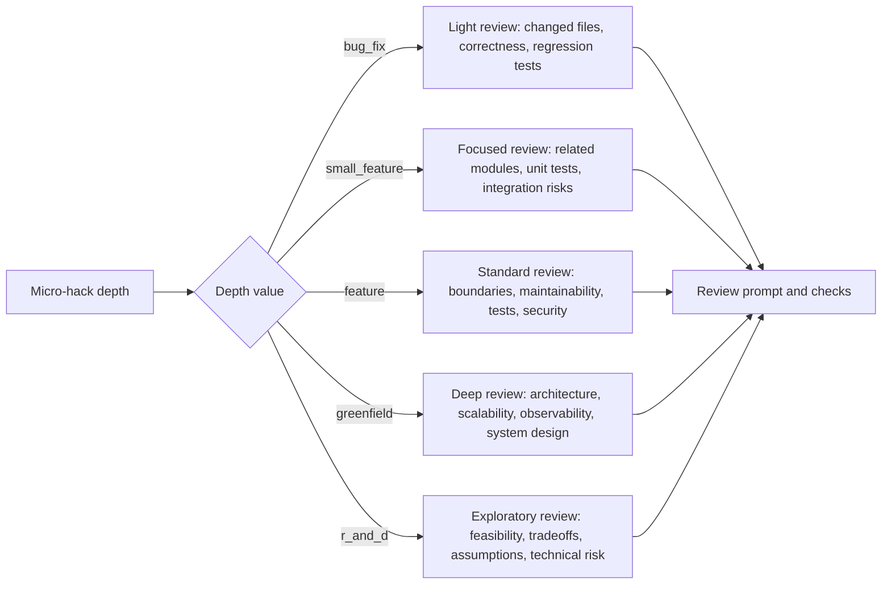
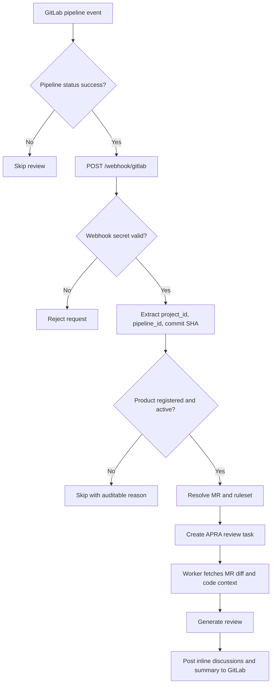
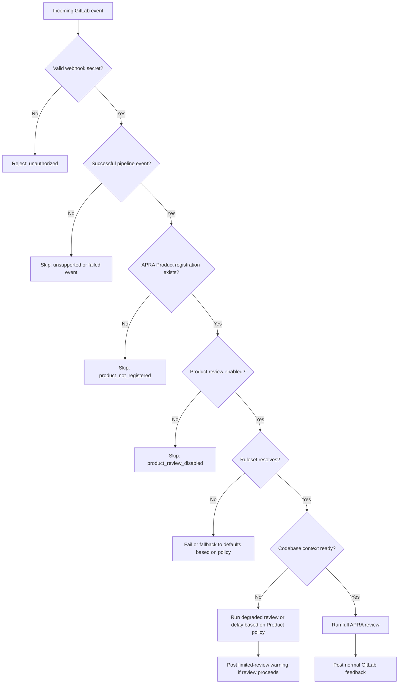

# Product Integration Process for APRA

This document defines how every newly onboarded Product is registered with the **AI Pull Request Review Agent (APRA)** so that micro-hackathon submissions against that Product are reviewed with the correct repository context, Product rules, and GitLab event wiring.

The purpose of this process is to make APRA onboarding a required step in the generalized Product Integration Template, alongside LeetDev Product registration and GitLab CI/CD setup.

---

## 1. Scope

When a new Product is integrated into LeetDev, APRA must be able to:

1. Identify the Product from GitLab webhook events.
2. Access and ingest the Product repository.
3. Load Product-specific review rules.
4. Adjust review depth based on the micro-hackathon round or challenge type.
5. Review Merge Requests after successful GitLab pipelines.
6. Post structured feedback, inline comments, and review summaries back to GitLab.

This document covers the integration process and system contract. It does not define implementation details for a specific database schema, API framework, or UI.

---

## 2. Integration Summary

The expected onboarding flow is:



After onboarding, the runtime review flow is:



---

## 3. System Responsibilities

| System | Responsibility |
| :--- | :--- |
| Product Integration Template | Ensures every Product has required metadata, GitLab repository details, and an APRA registration step. |
| LeetDev Product Layer | Owns Product identity, Product status, micro-hack definitions, round/depth metadata, and default onboarding workflow. |
| GitLab CI/CD Layer | Owns repository hosting, pipeline execution, webhook delivery, branch/MR lifecycle, and pipeline success signal. |
| APRA API Gateway | Receives GitLab webhooks, validates secrets, resolves Product configuration, creates review tasks, and enqueues work. |
| APRA Worker | Clones/analyzes code, applies Product rules, invokes LLM review, and publishes review output to GitLab. |
| Rules Registry | Stores default and Product-specific review rules, architecture constraints, checklists, and depth policies. |

No Product is considered fully onboarded until all three paths are complete:



---

## 4. Product Registration Contract

Each Product must have an APRA registration record. The registration record lets APRA map a GitLab event to Product-specific review behavior.

### Required Fields

| Field | Description |
| :--- | :--- |
| `product_id` | Stable internal Product identifier. |
| `product_name` | Human-readable Product name. |
| `status` | `active`, `disabled`, or `onboarding`. APRA reviews only active Products. |
| `gitlab_project_id` | GitLab project ID used to resolve incoming webhook events. |
| `gitlab_project_path` | GitLab namespace/project path, useful for diagnostics and fallback lookup. |
| `repo_url` | Clone URL for the Product repository. |
| `default_branch` | Product default branch, usually `main` or `master`. |
| `ruleset_id` | Ruleset applied to this Product. |
| `review_enabled` | Boolean flag controlling whether APRA should review this Product. |
| `webhook_secret_ref` | Reference to the secret used by GitLab webhook validation. |
| `default_micro_hack_depth` | Default depth used when a specific MR or round does not provide one. |
| `owners` | Product owners or maintainers for escalation. |

### Example

```json
{
  "product_id": "onehub-api",
  "product_name": "OneHub API",
  "status": "active",
  "gitlab_project_id": "12345",
  "gitlab_project_path": "onehub/services/onehub-api",
  "repo_url": "https://gitlab.example.com/onehub/services/onehub-api.git",
  "default_branch": "main",
  "ruleset_id": "onehub-api-default",
  "review_enabled": true,
  "webhook_secret_ref": "GITLAB_WEBHOOK_SECRET",
  "default_micro_hack_depth": "feature",
  "owners": ["platform-team", "onehub-maintainers"]
}
```

### Validation Rules

During onboarding, APRA registration must validate:

1. `gitlab_project_id` is unique across active Products.
2. `repo_url` is reachable by the configured GitLab token.
3. `default_branch` exists.
4. `ruleset_id` exists or can inherit from a default template.
5. `review_enabled` is explicitly set.
6. GitLab webhook secret matches the APRA gateway environment.
7. APRA can post a test note/comment to a test MR or dry-run endpoint.

---

## 5. Codebase Ingestion

APRA needs repository context before it can produce reliable reviews. Product integration must therefore include a codebase ingestion step.



### Ingestion Goals

The ingestion step should collect enough context to understand:

- repository structure;
- languages and frameworks;
- package/dependency files;
- major modules and boundaries;
- test layout;
- build and lint commands;
- architectural conventions;
- ownership or domain-specific folders;
- files that should be ignored during review.

### When Ingestion Runs

| Trigger | Expected Behavior |
| :--- | :--- |
| Product onboarding | Run initial full repository ingestion from the default branch. |
| Default branch changes | Refresh repository context after meaningful upstream changes. |
| Ruleset changes | Re-evaluate context if rules depend on repository structure or architecture boundaries. |
| MR review | Use stored context; refresh if stale or missing. |
| Ingestion failure | Keep Product in `onboarding` or `review_disabled` state until fixed. |

### Ingestion Output

The ingestion result should produce a reusable Product context record:

```json
{
  "product_id": "onehub-api",
  "gitlab_project_id": "12345",
  "default_branch": "main",
  "last_indexed_commit": "abc123def456",
  "languages": ["TypeScript", "Python"],
  "frameworks": ["FastAPI", "React"],
  "dependency_files": ["requirements.txt", "package.json"],
  "test_locations": ["tests/", "src/**/*.test.ts"],
  "architecture_summary": "API routes delegate to services; database access is restricted to repository modules.",
  "ignored_paths": ["dist/", "build/", "node_modules/", ".venv/"],
  "ingestion_status": "ready"
}
```

### Freshness Policy

APRA should not block every review on a full re-index. A practical policy is:

1. Use the latest successful Product context by default.
2. If no Product context exists, run ingestion before review.
3. If the indexed commit is too old or the repository structure changed significantly, refresh context asynchronously.
4. If ingestion fails but MR diff data is available, APRA may run a degraded review using changed files only and mark the review as limited.

---

## 6. Rules Registry

The Rules Registry stores review expectations per Product. It should support defaults from the Product Integration Template and Product-specific overrides.



### Ruleset Categories

| Category | Purpose |
| :--- | :--- |
| Style and lint | Naming, formatting, lint rules, import rules, code organization. |
| Architecture | Layering, module boundaries, dependency direction, framework-specific patterns. |
| Testing | Required unit, integration, regression, or contract tests. |
| Security | Secrets handling, input validation, auth checks, dependency risks. |
| Performance | Query efficiency, caching expectations, payload size, algorithmic concerns. |
| Maintainability | Simplicity, readability, duplication, observability, error handling. |
| Definition of done | Minimum requirements before an MR should be considered acceptable. |
| Review checklist | Explicit checklist APRA should apply during review. |

### Default and Override Model

Rules should resolve in this order:

```text
Global APRA defaults
  -> Product Integration Template defaults
  -> Product family defaults
  -> Product-specific rules
  -> Micro-hack or round-specific rules
```

The most specific rule wins when there is a conflict.

### Example Ruleset

```json
{
  "ruleset_id": "onehub-api-default",
  "product_id": "onehub-api",
  "inherits": ["apra-default", "backend-service-default"],
  "style": [
    "Follow existing route -> service -> repository layering.",
    "Use existing error response format for API failures."
  ],
  "architecture": [
    "Route handlers must not access the database directly.",
    "Cross-service calls must go through approved client modules.",
    "Do not introduce new global state without an explicit reason."
  ],
  "testing": [
    "Bug fixes require regression tests.",
    "New service behavior requires unit tests.",
    "API contract changes require integration tests or documented compatibility notes."
  ],
  "security": [
    "Do not commit secrets or tokens.",
    "Validate external input at API boundaries.",
    "Do not bypass existing authorization middleware."
  ],
  "definition_of_done": [
    "CI pipeline passes.",
    "No critical APRA findings remain unresolved.",
    "Required tests are present for the micro-hack depth."
  ]
}
```

### Rule Severity

Rules should allow severity so APRA can decide whether to recommend merge.

| Severity | Meaning |
| :--- | :--- |
| `CRITICAL` | Must fix before merge; security, data loss, broken build, severe correctness issue. |
| `HIGH` | Should fix before merge; likely production bug, major maintainability or architecture violation. |
| `MEDIUM` | Important improvement; acceptable only with Product owner approval. |
| `LOW` | Style, cleanup, readability, small risk. |

---

## 7. Micro-Hack Depth Awareness

APRA review rigor must scale with the depth of the micro-hackathon round or challenge. This prevents small bug-fix submissions from receiving excessive architecture feedback while ensuring deep greenfield work receives system-level review.



### Depth Levels

| Depth | Review Scope | Expected Focus |
| :--- | :--- | :--- |
| `bug_fix` | Changed files and nearby tests. | Correctness, regression risk, edge cases, minimality. |
| `small_feature` | Changed files plus directly related modules. | Correctness, integration, tests, maintainability. |
| `feature` | Changed files, dependencies, service boundaries, tests. | Product fit, architecture consistency, test coverage, error handling. |
| `greenfield` | Full feature design and affected subsystem. | Architecture, scalability, modularity, observability, long-term maintainability. |
| `r_and_d` | Proposal quality, implementation tradeoffs, assumptions. | Feasibility, technical risk, experimentation quality, system design reasoning. |

### Depth Resolution

APRA should resolve depth in this order:

1. Explicit micro-hack round metadata from LeetDev.
2. MR labels or metadata set by the submission pipeline.
3. Product default depth from APRA registration.
4. Global fallback depth, usually `feature`.

### Depth-Based Review Behavior

| Behavior | `bug_fix` | `small_feature` | `feature` | `greenfield` / `r_and_d` |
| :--- | :--- | :--- | :--- | :--- |
| Inline comments | Yes | Yes | Yes | Yes |
| Test expectations | Regression tests | Unit tests | Unit + integration where needed | Design validation + broad coverage |
| Architecture review | Minimal | Local module impact | Service/module boundaries | Full system design impact |
| Performance review | Only obvious regressions | Basic checks | Data flow and query concerns | Scalability and operational concerns |
| Security review | Changed inputs/secrets | Changed inputs/auth | Auth, validation, data boundaries | Threat model and sensitive flows |
| Merge recommendation strictness | Focus on critical/high correctness issues | Correctness + missing tests | Ruleset + architecture consistency | Ruleset + design quality + risk |

---

## 8. GitLab Hook Wiring

APRA is triggered by GitLab after the Product pipeline succeeds.



### Required GitLab Webhook Settings

| Setting | Value |
| :--- | :--- |
| URL | `https://<apra-gateway-domain>/webhook/gitlab` |
| Secret Token | Must match APRA `GITLAB_WEBHOOK_SECRET`. |
| Trigger events | Pipeline events. |
| SSL verification | Enabled for production. |

APRA currently expects successful pipeline events as the primary trigger. Push-only or MR-only events should not be required for standard review execution.

### Runtime Event Contract

GitLab webhook events must provide enough information for APRA to resolve:

- GitLab project ID;
- pipeline ID and status;
- commit SHA;
- source branch;
- associated Merge Request;
- MR IID;
- repository URL or project path.

APRA then uses the GitLab API to fetch MR details, changed files, diffs, and diff refs for inline comment placement.

### Product Resolution

When a webhook arrives:

1. APRA validates the webhook secret.
2. APRA confirms the event is a successful pipeline event.
3. APRA extracts `project_id`.
4. APRA looks up the APRA Product registration by `gitlab_project_id`.
5. If no active Product registration exists, APRA rejects or ignores the event with an auditable reason.
6. If Product review is disabled, APRA records the skip reason and does not enqueue review work.
7. If Product review is enabled, APRA loads the Product ruleset and creates a review task.

### Posting Feedback

APRA should post:

1. A general MR summary comment.
2. Inline comments for file/line-specific issues when GitLab diff refs are available.
3. A fallback general comment if inline placement fails.
4. A merge recommendation such as `MERGE`, `MERGE_WITH_CAUTION`, or `DO_NOT_MERGE`.
5. Review metadata, including Product ID, ruleset ID, depth, score, and limited-review warnings if applicable.

---

## 9. Required Onboarding Step

The generalized Product Integration Template must include this step:

```text
Register Product with AI PR Review Agent
```

### APRA Onboarding Checklist

```text
[ ] Confirm Product metadata exists in LeetDev.
[ ] Confirm GitLab repository exists.
[ ] Confirm GitLab CI pipeline runs successfully.
[ ] Create APRA Product registration.
[ ] Attach default or Product-specific ruleset.
[ ] Validate GitLab token can read the repository.
[ ] Validate APRA can clone the default branch.
[ ] Run initial codebase ingestion.
[ ] Configure GitLab pipeline webhook to APRA.
[ ] Verify webhook secret matches APRA gateway configuration.
[ ] Submit or replay a test pipeline event.
[ ] Confirm APRA creates a review task.
[ ] Confirm APRA posts feedback to a test Merge Request.
[ ] Mark Product APRA status as active.
```

### Exit Criteria

A Product is APRA-ready only when:

1. Product registration is active.
2. GitLab webhook test succeeds.
3. Codebase ingestion status is `ready`.
4. Ruleset resolution succeeds.
5. A test MR receives APRA feedback.
6. Product owner has approved the default ruleset and review depth policy.

---

## 10. Review Task Contract

When APRA creates a review task, the task should include or be able to resolve:

```json
{
  "task_type": "gitlab_mr_review",
  "product_id": "onehub-api",
  "gitlab_project_id": "12345",
  "mr_iid": "77",
  "pipeline_id": "98765",
  "commit_sha": "abc123def456",
  "source_branch": "candidate/round-2",
  "target_branch": "main",
  "ruleset_id": "onehub-api-default",
  "micro_hack_depth": "feature",
  "review_mode": "standard",
  "code_context_ref": "onehub-api:main:abc123def456"
}
```

APRA should not depend only on data included in the webhook. The webhook should be treated as a trigger, and APRA should fetch authoritative MR details from GitLab before review.

---

## 11. Edge Cases and Expected Handling

The main skip/failure handling path is:



| Case | Expected Handling |
| :--- | :--- |
| Product is not registered in APRA | Skip review and log an auditable `product_not_registered` reason. |
| Product is registered but disabled | Skip review and log `product_review_disabled`. |
| Webhook secret mismatch | Reject request with unauthorized response; do not create task. |
| Pipeline failed | Do not review; APRA reviews only successful pipeline events by default. |
| No MR found for pipeline | Mark task as failed or skipped with `mr_not_resolved`. |
| Ruleset missing | Fall back to default rules only if allowed; otherwise block Product activation. |
| Codebase ingestion missing | Run degraded changed-files-only review or delay review until ingestion completes, based on Product policy. |
| Codebase ingestion stale | Use last successful context and queue refresh, unless Product requires strict freshness. |
| GitLab clone fails | Mark review failed and surface token/repo access issue to Product owner. |
| Inline comments fail | Post findings in general MR comment fallback. |
| LLM output contains invalid file or line | Filter invalid comments before GitLab posting. |
| Duplicate webhook delivery | Enforce idempotency using project ID, MR IID, pipeline ID, and commit SHA. |
| Product rules conflict with global defaults | Product-specific rule wins, unless global rule is marked mandatory. |
| Micro-hack depth missing | Use Product default depth, then global fallback. |
| Large repository exceeds prompt limits | Use indexed summaries and changed files first; prune lower-value context. |
| Sensitive files are changed | Apply security rules and avoid exposing secret values in comments or prompts. |

---

## 12. Security and Access Requirements

APRA registration must ensure:

1. GitLab token has read access to repository, pipelines, MRs, commits, and diffs.
2. GitLab token has write access to MR comments/discussions.
3. Webhook secret is configured through environment/secret management, not stored in plain Product config.
4. Repository clone URLs are authenticated safely.
5. Secrets found in code or diffs are not repeated in review comments.
6. Disabled or archived Products cannot trigger review jobs.
7. Product-specific rules do not expose private business details to unauthorized users.

---

## 13. Observability Requirements

APRA should record the following metadata for each Product review:

- `product_id`;
- `gitlab_project_id`;
- `mr_iid`;
- `pipeline_id`;
- `commit_sha`;
- `ruleset_id`;
- `micro_hack_depth`;
- `review_mode`;
- `code_context_version`;
- review status;
- skip/failure reason if applicable;
- token usage and prompt pruning status;
- GitLab posting status.

These fields make it possible to debug whether a failure came from Product onboarding, GitLab CI/CD, repository access, ruleset resolution, or APRA execution.

---

## 14. Acceptance Criteria

The APRA Product integration process is complete when:

1. The Product Integration Template contains a required APRA registration step.
2. APRA has a documented Product registration contract.
3. APRA has a documented ruleset registry model.
4. Codebase ingestion is defined for onboarding, refresh, and fallback cases.
5. Micro-hack depth resolution and review behavior are defined.
6. GitLab webhook wiring is defined.
7. Runtime event handling and Product resolution are defined.
8. Edge cases and failure behavior are documented.
9. A test MR can verify end-to-end behavior for each newly onboarded Product.

---

## 15. Minimal Implementation Roadmap

Although this document is process-focused, the expected implementation can be delivered in phases:

### Phase 1: Manual Configuration

- Maintain APRA Product registration and rulesets as versioned configuration.
- Configure GitLab webhooks manually during Product onboarding.
- Run initial ingestion manually or through an admin script.
- Validate with a test MR.

### Phase 2: Product Template Integration

- Add APRA registration to the Product Integration Template.
- Generate default APRA config from Product metadata.
- Add onboarding validation checks.
- Store ingestion status and ruleset status.

### Phase 3: Automated APRA Onboarding

- Provide an internal API or admin workflow to register Products.
- Automatically create or update GitLab webhooks.
- Automatically run ingestion after Product registration.
- Automatically verify end-to-end review readiness.

### Phase 4: Continuous Governance

- Refresh codebase context on default branch changes.
- Track ruleset versions.
- Compare review outcomes by Product and micro-hack depth.
- Alert Product owners for failed ingestion, missing rules, or broken GitLab hooks.
